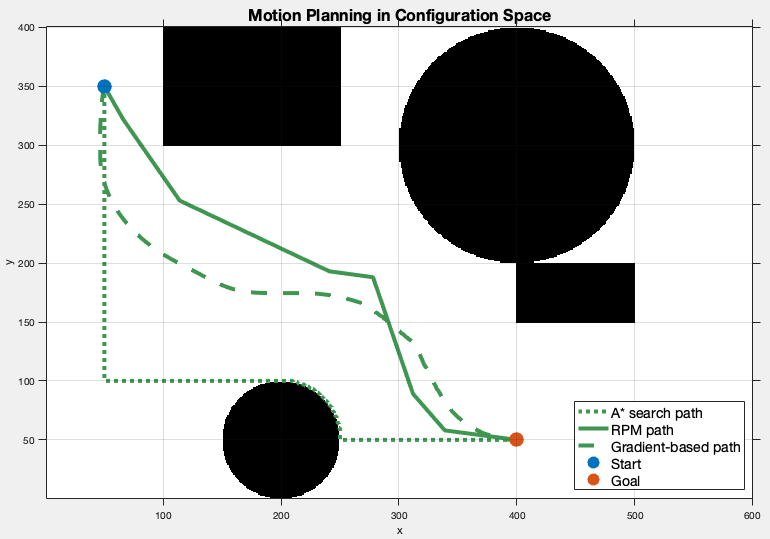
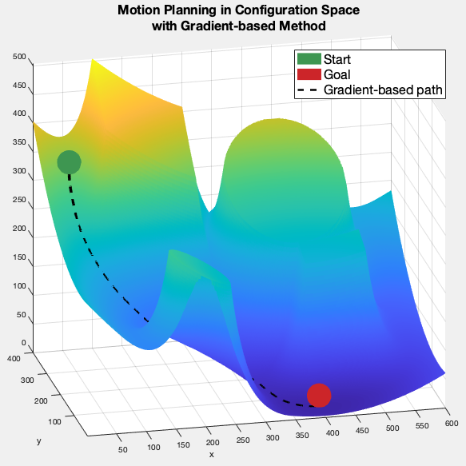

# 2D Path Planning Algorithm Implementation
This is a self-learning project of path planning algorithms in MATLAB.
It mainly focuses on building and implementing A* search, PRM, and gradient descent methods. 

Built planning algorithms:
 - A*
 - PRM
 - Gradient Descent

# How to use
## 1. Run PotentialFieldScript.m
